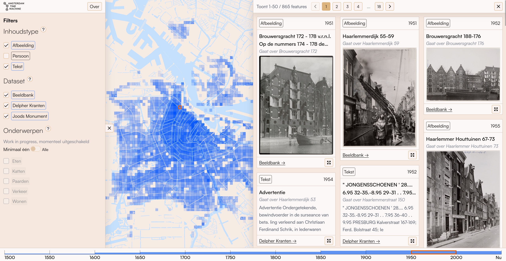
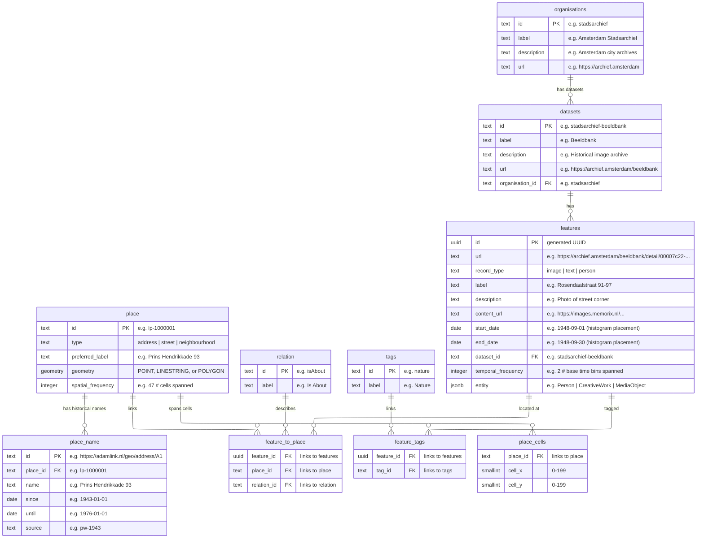

# [Amsterdam Time Machine Data Index](https://data.amsterdamtimemachine.nl)

The Amsterdam Time Machine [Data Index](https://data.amsterdamtimemachine.nl) provides location-based access to historical information about Amsterdam across centuries. It serves as a unified entry point to heritage collections from multiple Amsterdam and national institutions, connecting digitised sources through place and time.

The interface overlays Amsterdam with a spatial heatmap grid and a timeline spanning the 17th century to the present in configurable periods. Each grid cell shows the density of available data for that area and time period. Clicking a cell reveals the available images, texts, and person records from that neighbourhood. All results link directly to the original source at the holding institution.

Rather than curating or contextualising the data, the index presents sources as they are, including any OCR errors or metadata gaps. This makes visible not only what is documented but also what is missing, inviting critical reflection on digitisation practices and historical documentation.

## Architecture

```
packages/
  shared/       TypeScript types and configuration
  db/           PostgreSQL 16 + PostGIS 3.4, Drizzle ORM, ETL scripts
  app/          SvelteKit 5, MapLibre GL, TailwindCSS
```

Runtime: Bun. Infrastructure: Docker Compose. Map tiles: OpenFreeMap.

### Data model



- **organisations**: Institutions that provide datasets
- **datasets**: Data collections from organisations
- **place**: Physical locations stored in RD coordinates (EPSG:28992)
- **place_name**: Historical names linked to places (addresses, streets), used to show what a location was called at a given time
- **tags**: Thematic categories (e.g. Nature, Transport, Living) assigned to features. Work in progress, generated via AI classification across datasets
- **features**: Images, texts, persons, or other content items linked to places and displayed in the UI
- **place_cells**: Pre-computed spatial grid that powers the heatmap. Each place is mapped to the 100m cells its geometry covers (one cell for a point, many for a street or neighbourhood). Features inherit cell coverage through their place link, so cell assignments are stored once per place rather than duplicated per feature.
- **spatial_frequency**: How many grid cells a place spans. Stored on `place`, inherited by all features linked to it. Features at more specific locations (fewer cells) rank higher in search results.
- **temporal_frequency**: How many base time bins a feature spans. Stored on `features` (each feature has its own date range). Features covering fewer bins are more temporally specific and rank higher in search results.

## Indexing

The data index is restricted to historical features that can be both spatially located (linked to a place with geometry) and temporally located (with a date range). `rebuild-index` precomputes a fixed-resolution spatial grid and a fixed-resolution timeline once after ingestion; the UI then aggregates those base units into coarser display grids and histogram bins on demand.

### Spatial

Each feature is linked to one or more `place` rows via `feature_to_place`. Each place stores a geometry (POINT, LINESTRING, or POLYGON) in **RD New (EPSG:28992, metres)**. Query responses reproject to **WGS84 (EPSG:4326)** before sending to the client. `rebuild-index` overlays the city with a regular grid of `CELL_SIZE_METERS`-wide cells (default 100m) anchored to the bounding box of all geometries in the `place` table, and writes the cells each place covers to `place_cells` — one set of cells per place, not per feature. A point lands in one cell, a line in the cells it crosses, and a polygon is filled (its interior, not just its outline). Features inherit cell coverage through their place link. Heatmap requests join `place_cells` → `feature_to_place` → `features` and count distinct features per cell, instead of scanning every feature row.

Heatmap density is rendered with log-normalised counts (`log(count+1) / log(maxCount+1)`).

### Temporal

Each feature has `start_date` and `end_date`, both inclusive at the year level. A feature with `start_date=1900-06-15` and `end_date=1900-08-30` covers exactly the year 1900. Time is divided into base bins of `BASE_BIN_SIZE` years (default 10), each spanning `[bin_start, bin_end)`: start year inclusive, end year exclusive. A feature is assigned to every bin its year range overlaps: a feature spanning 1900–1925 with 10-year bins falls into `[1900,1910)`, `[1910,1920)`, and `[1920,1930)`. Its `temporal_frequency` is the count of those bins (3 here).

The timeline (rendered as a histogram) uses the same overlap logic but at the display bin size requested by the client. Display bin size is clamped to `[BIN_SIZE_MIN, BIN_SIZE_MAX]`.

Timeline bar heights use the same log normalisation as the heatmap.

### Unique features rank higher

Indexing also stores two counters per feature. `spatial_frequency` counts the base cells a feature's place(s) touch. `temporal_frequency` counts the base bins its date range covers. They serve as a specificity signal: a photograph of one building on one day is more useful than a region-wide survey spanning centuries. Both are normalised by the dataset maximum and summed into a `relevance_score`:

```
relevance_score = spatial_frequency / max_spatial + temporal_frequency / max_temporal
```

Lower scores mean features more unique to the time and place.

## Data ingestion

### Place data

The project uses [Adamlink](https://adamlink.nl) as its geographic backbone. Adamlink is a Linked Open Data service that connects historical Amsterdam address registries to point geometries, enabling features to be linked to physical locations with historical address names.

Adamlink place data must be ingested before any dataset: run `districts` and `streets` first (from TTL files), then `lps` and `adressen` (from CSVs). See the [Development](#development) or [Production](#production) sections for the full ingestion order.

Every `place` row is sourced from Adamlink. Features that can't be resolved to an existing Adamlink place are skipped at ingest; no feature row is created and nothing unlinked lands in the database.

If you are deploying this for a different city, you can bypass Adamlink by having your ingestion scripts create `place` rows directly with your own IDs and geometries. The `geometry-template.ts` example shows how to match incoming coordinates to existing places; for creating new places, adapt the pattern from `lps.ts`. The core requirement is that each feature links to a `place` row that has a geometry.

### Minimum required fields per feature

Each feature needs at minimum:
- **label**: Display name
- **record_type**: One of `image`, `text`, `person` (the frontend renders each type differently)
- **start_date** / **end_date**: Date range for temporal placement on the histogram
- **place link**: Each feature must be linked to one or more physical locations (e.g. a journal entry mentioning several places links to each). Two methods are supported:
  - **Adamlink URI**: if your data references Adamlink address or street IDs, the ingestion script resolves them to places via the `place_name` table or `place` table (requires place data to be ingested first)
  - **WKT geometry point**: if your data only has coordinates, the ingestion script finds the nearest existing place within a configurable distance threshold (e.g. 5 meters)

Optional: `description`, `content_url` (media), `entity` (schema.org JSONB), `url` (source link).

### Adding a dataset

1. Pick a template from `packages/db/src/etl/examples/`:
   - `adamlink-template.ts` for data referencing Adamlink address URIs
   - `geometry-template.ts` for data without Adamlink references (matches coordinates to nearest place)
2. Copy it to `packages/db/src/etl/sources/<your-dataset>.ts`
3. Update organisation, dataset, relation, and field mappings
4. Run:

```bash
bun run db:ingest -s <dataset-name> -f <path-to-file>
bun run db:rebuild-index
```

`rebuild-index` computes spatial grid cells and frequency values. Must run after every data change.

### Re-ingesting and corrections

Ingestion is idempotent. A feature's id is derived from its source URL, so re-running a source updates existing rows in place rather than creating duplicates. To apply a correction, fix the source file, re-ingest that source, then run `rebuild-index`:

- Feature content is upserted, and a corrected place link replaces the old one instead of adding a second.
- Place geometry is refreshed on re-ingest — streets and neighbourhoods also refresh their label from the source, while addresses keep the label derived by `adressen`.
- Sources that list the same item more than once dedup it by its natural key.

Re-running the same file is a no-op.

### Current datasets

| Dataset | Description | Access |
|---------|-------------|--------|
| [Districts](https://adamlink.nl/geo/districts) | Historical neighbourhood/district polygons (wijken1600, buurten1850, buurten1909) from Adamlink TTL | Public |
| [Streets](https://adamlink.nl/data) | Street geometries (LineString) with historical name variants from Adamlink TTL | Public |
| [LPS](https://adamlink.nl/downloads/20230920-lps.csv.zip) | Linked point set: historical address-to-geometry mappings from 7 Amsterdam registries (1832–1976) | Public |
| [Adressen](https://adamlink.nl/downloads/20230920-adressen.csv.zip) | Address labels (street name + house number) for Adamlink address IDs | Public |
| Beeldbank | Historical images from Amsterdam Stadsarchief | Private |
| Joods Monument | Holocaust victims with last known Amsterdam addresses | Private |
| Delpher | Digitised Dutch newspaper articles from Koninklijke Bibliotheek | Private |

## API endpoints

| Endpoint | Purpose |
|----------|---------|
| `GET /api/metadata` | Time slices, record types, datasets, stats |
| `GET /api/heatmaps` | Sparse heatmap data with grid dimensions |
| `GET /api/histogram` | Feature count distribution by time period |
| `GET /api/features` | Paginated features within geographic bounds |
| `GET /api/available-tags` | Tags with feature counts |

Heatmaps, histogram, features, and available-tags accept `recordTypes`, `datasets`, and `placeTypes` (`address` / `street` / `neighbourhood`) query parameters to filter results.

## Development

### Prerequisites

- [Bun](https://bun.sh)
- [Docker](https://docker.com) with Docker Compose

### First time setup

```bash
bun install
cp .env.example .env

# Start bundled Postgres + PostGIS
bun run docker:db:up

# Push schema
bun run db:push-schema

# Ingest place data (required before any dataset)
bun run db:ingest -s districts -f <path-to-adamlinkbuurten.ttl>
bun run db:ingest -s streets -f <path-to-adamlinkstraten.ttl>
bun run db:ingest -s lps -f <path-to-lps.csv>
bun run db:ingest -s adressen -f <path-to-adressen.csv>

# Ingest datasets (any order)
bun run db:ingest -s <dataset-name> -f <path-to-file>

# Rebuild index
bun run db:rebuild-index

# Run the frontend
bun run dev    # http://localhost:5175
```

### Database UI

```bash
bun run db:studio    # http://local.drizzle.studio
```

### Testing

Tests run against an isolated Postgres+PostGIS container (port `5434`, tmpfs volume, data wiped on restart, never touches the dev DB). Integration tests exercise the full pipeline end-to-end: LPS + adressen + beeldbank + Joods Monument ingestion on real-data fixtures under `packages/db/src/__tests__/fixtures/`, then the query layer (features, heatmap, timeline, histogram) and `rebuild-index`.

```bash
bun run test:db:up     # start the isolated test DB
bun run test           # full suite (64 tests: 24 unit + 40 integration)
bun run test:unit      # unit tests only (no DB needed)
bun run test:db:down   # stop and wipe the test DB
```

## Production

The app needs a PostgreSQL + PostGIS database. In production there is **External DB** mode where Data index connects to an existing DB, and **self-hosted** mode where a Postgres container is bundled alongside the app container.

### First time server setup (external DB)

```bash
ssh user@server

# Install Bun
curl -fsSL https://bun.sh/install | bash

# Clone repo
git clone git@github.com:amsterdamtimemachine/data-index.git ~/data-index && cd ~/data-index
bun install

# Set up production env (point at the existing Postgres server)
cp .env.example .env.prod
# Edit .env.prod: set DB_HOST / DB_PORT / DB_USER / DB_PASSWORD / DB_NAME to
# match the production database, and set APP_PORT (defaults to 3000).
# The app does NOT manage this server; assume it's already running and
# reachable from the VPS.

# Push schema into the existing DB (uses .env.prod via Bun's --env-file flag)
bun --env-file=.env.prod run db:push-schema

# Ingest place data (same env file)
bun --env-file=.env.prod run db:ingest -s districts -f <path-to-adamlinkbuurten.ttl>
bun --env-file=.env.prod run db:ingest -s streets -f <path-to-adamlinkstraten.ttl>
bun --env-file=.env.prod run db:ingest -s lps -f <path-to-lps.csv>
bun --env-file=.env.prod run db:ingest -s adressen -f <path-to-adressen.csv>

# Ingest feature datasets
bun --env-file=.env.prod run db:ingest -s beeldbank -f <path-to-beeldbank.csv>
bun --env-file=.env.prod run db:ingest -s joods-monument -f <path-to-results_jm.csv>
bun --env-file=.env.prod run db:ingest -s delpher -f <path-to-delpher_newspapers.csv>
bun --env-file=.env.prod run db:rebuild-index

# Start the app (connects to the external DB defined in .env.prod)
docker compose --project-name data-index-prod --env-file .env.prod \
  -f docker/docker-compose.yml \
  -f docker/docker-compose.production.yml up -d app
```

`--project-name data-index-prod` is necessary if you're running a staging deployment alongside. See below.

#### Adding staging alongside

```bash
cp .env.example .env.staging
# Edit .env.staging:
#   - DB_* → point at a staging Postgres (don't reuse production's DB)
#   - APP_PORT=3001 (or any free port ≠ production's)

# Push schema + ingest into the staging DB
bun --env-file=.env.staging run db:push-schema
bun --env-file=.env.staging run db:ingest -s districts -f <path-to-adamlinkbuurten.ttl>
bun --env-file=.env.staging run db:ingest -s streets -f <path-to-adamlinkstraten.ttl>
bun --env-file=.env.staging run db:ingest -s lps -f <path-to-lps.csv>
# …and the other datasets, same pattern as production…
bun --env-file=.env.staging run db:rebuild-index

# Start the staging container alongside production
docker compose --project-name data-index-staging --env-file .env.staging \
  -f docker/docker-compose.yml \
  -f docker/docker-compose.staging.yml up -d app
```

### First time server setup (self-hosted)

```bash
ssh user@server

# Install Bun
curl -fsSL https://bun.sh/install | bash

# Clone repo
git clone git@github.com:amsterdamtimemachine/data-index.git ~/data-index && cd ~/data-index
bun install

# Set up production env (defaults target the bundled DB)
cp .env.example .env.prod
# Edit .env.prod: change DB_PASSWORD (and DB_USER / DB_NAME if you want).
# Leave DB_HOST=localhost (workstation CLI hits the mapped DB port; the
# self-hosted overlay overrides DB_HOST for the app container internally).

# Start the bundled Postgres + PostGIS (production overlay binds it to loopback)
docker compose --project-name data-index-prod --env-file .env.prod \
  -f docker/docker-compose.yml \
  -f docker/docker-compose.self-hosted.yml \
  -f docker/docker-compose.production.yml up -d dataindex-db

# Push schema
bun --env-file=.env.prod run db:push-schema

# Ingest place data
bun --env-file=.env.prod run db:ingest -s districts -f <path-to-adamlinkbuurten.ttl>
bun --env-file=.env.prod run db:ingest -s streets -f <path-to-adamlinkstraten.ttl>
bun --env-file=.env.prod run db:ingest -s lps -f <path-to-lps.csv>
bun --env-file=.env.prod run db:ingest -s adressen -f <path-to-adressen.csv>

# Ingest feature datasets
bun --env-file=.env.prod run db:ingest -s beeldbank -f <path-to-beeldbank.csv>
bun --env-file=.env.prod run db:ingest -s joods-monument -f <path-to-results_jm.csv>
bun --env-file=.env.prod run db:ingest -s delpher -f <path-to-delpher_newspapers.csv>
bun --env-file=.env.prod run db:rebuild-index

# Start the app container alongside the DB
docker compose --project-name data-index-prod --env-file .env.prod \
  -f docker/docker-compose.yml \
  -f docker/docker-compose.self-hosted.yml \
  -f docker/docker-compose.production.yml up -d app
```

### CI/CD

Two workflows publish images to GitHub Container Registry (GHCR). Both run the full test suite (inside a PostGIS service container) and only push if tests pass. Neither deploys to the server. Pulling and restarting is a manual step, which keeps the server's SSH surface private.

| Branch | Workflow | Image tags |
|---|---|---|
| `main` | `.github/workflows/production.yml` | `production`, `production-<sha>` |
| `staging` | `.github/workflows/staging.yml` | `staging`, `staging-<sha>` |

Use `staging` to test a build before merging to `main`: push your branch into `staging`, wait for the workflow, then pull the staging image on the VPS to verify.

### Deploying a new image

Each deployment is scoped by `--project-name` and reads its own `--env-file` so production and staging don't collide.

```bash
ssh user@server
cd ~/data-index

# Log in to GHCR (one-time, or when token expires)
echo $GHCR_TOKEN | docker login ghcr.io -u <github-user> --password-stdin

# Production
docker compose --project-name data-index-prod --env-file .env.prod \
  -f docker/docker-compose.yml \
  -f docker/docker-compose.production.yml pull app
docker compose --project-name data-index-prod --env-file .env.prod \
  -f docker/docker-compose.yml \
  -f docker/docker-compose.production.yml up -d app

# Staging
docker compose --project-name data-index-staging --env-file .env.staging \
  -f docker/docker-compose.yml \
  -f docker/docker-compose.staging.yml pull app
docker compose --project-name data-index-staging --env-file .env.staging \
  -f docker/docker-compose.yml \
  -f docker/docker-compose.staging.yml up -d app
```

### Environment variables

| Variable | Required | Default | Description |
|----------|----------|---------|-------------|
| `DB_HOST` | Yes | `localhost` | PostgreSQL host (use `localhost` when workstation CLI hits the self-hosted DB; use the remote host for external DB) |
| `DB_PORT` | No | `5432` | PostgreSQL port |
| `DB_USER` | Yes | `atm` | PostgreSQL user |
| `DB_PASSWORD` | Yes | `atm_dev_password` | PostgreSQL password |
| `DB_NAME` | Yes | `amsterdam_time_machine` | PostgreSQL database name |
| `APP_PORT` | No | `3000` | App port on host |
| `PUBLIC_DEFAULT_CELL` | No | - | Default cell to select on load |
| `PUBLIC_TILE_SOURCE_URL` | No | OpenFreeMap | Vector tile source URL |
| `BASE_BIN_SIZE` | No | `10` | Base time bin size (years) |
| `CELL_SIZE_METERS` | No | `100` | Base spatial cell size (meters) |
| `GRID_DEFAULT` | No | `75` | Default heatmap grid resolution |
| `GRID_MIN` / `GRID_MAX` | No | `10` / `200` | Grid resolution bounds |
| `DEFAULT_BIN_SIZE` | No | `50` | Default display bin size (years) |
| `BIN_SIZE_MIN` / `BIN_SIZE_MAX` | No | `10` / `100` | Bin size bounds (years) |
| `CACHE_TTL_MINUTES` | No | `10` | TTL for cached DB queries |
