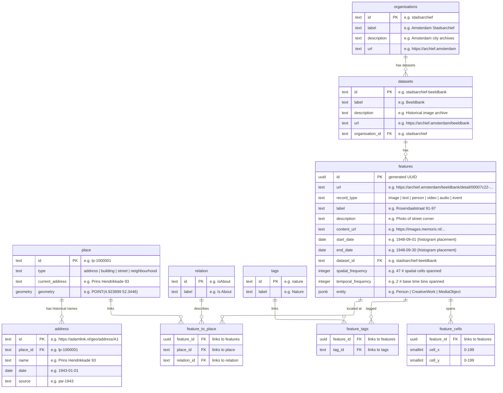

# [Amsterdam Time Machine Data Index](https://data.amsterdamtimemachine.nl)

The Amsterdam Time Machine [Data Index](https://data.amsterdamtimemachine.nl) provides location-based access to historical information about Amsterdam across centuries. It serves as a unified entry point to heritage collections from multiple Amsterdam and national institutions, connecting digitised sources through place and time.

The interface overlays Amsterdam with a spatial heatmap grid and a timeline spanning the 17th century to the present in configurable periods. Each grid cell shows the density of available data for that area and time period. Clicking a cell reveals the available images, texts, and person records from that neighbourhood. All results link directly to the original source at the holding institution.

Rather than curating or contextualising the data, the index presents sources as they are, including any OCR errors or metadata gaps. This makes visible not only what is documented but also what is missing, inviting critical reflection on digitisation practices and historical documentation.

## Architecture

```
packages/
  shared/       TypeScript types and configuration
  db/           PostgreSQL 16 + PostGIS 3.4, Drizzle ORM, ETL scripts
  app/          SvelteKit 5, MapLibre GL, TailwindCSS
```

Runtime: Bun. Infrastructure: Docker Compose. Map tiles: OpenFreeMap.

### Data model



- **organisations**: Institutions that provide datasets
- **datasets**: Data collections from organisations
- **place**: Physical locations stored in RD coordinates (EPSG:28992)
- **address**: Historical address names linked to places, used to show what a location was called at a given time
- **tags**: Thematic categories (e.g. Nature, Transport, Living) assigned to features. Work in progress, generated via AI classification across datasets
- **features**: Images, texts, persons, or other content items linked to places and displayed in the UI
- **feature_cells**: Pre-computed spatial grid that powers the heatmap. Each feature is mapped to the 100m cells it covers, so the heatmap can render without scanning all features per request
- **spatial_frequency**: How many grid cells a feature spans. Features covering fewer cells are more geographically specific and rank higher in search results
- **temporal_frequency**: How many base time bins a feature spans. Features covering fewer bins are more temporally specific and rank higher in search results

## Data ingestion

### Minimum required fields per feature

Each feature needs at minimum:
- **label**: Display name
- **record_type**: One of `image`, `text`, `person` (the frontend renders each type differently)
- **start_date** / **end_date**: Date range for temporal placement on the histogram
- **place link**: Each feature must be linked to a physical location. Two methods are supported:
  - **Adamlink URI** — if your data references Adamlink address IDs, the ingestion script resolves them to places via the `address` table (requires LPS + adressen data to be ingested first)
  - **WKT geometry point** — if your data only has coordinates, the ingestion script finds the nearest existing place within a configurable distance threshold (e.g. 5 meters)

Optional: `description`, `content_url` (media), `entity` (schema.org JSONB), `url` (source link).

### Adding a dataset

1. Copy `packages/db/src/etl/sources/template.ts` and rename to your dataset name
2. Define your organisation, dataset, and relation
3. Map your source data fields to features
4. Run:

```bash
bun run db:ingest -s <dataset-name> -f <path-to-file>
bun run db:rebuild-index
```

`rebuild-index` computes spatial grid cells and frequency values. Must run after every data change.

### Place data

The project uses [Adamlink](https://adamlink.nl) as its geographic backbone. Adamlink is a Linked Open Data service that connects historical Amsterdam address registries (1832 to 1976) to point geometries, enabling features to be linked to physical locations with historical address names.

If you are deploying this for a different city, you can bypass Adamlink by having your ingestion scripts create `place` rows directly with your own IDs and geometries. See the Joods Monument and Delpher ingestion scripts for examples of creating places on the fly or matching by geometry. The core requirement is that each feature links to a `place` row that has a geometry.

For Amsterdam deployments, ingest the Adamlink place data first:

```bash
# 1. Places + address mappings (must run first)
bun run db:ingest -s lps -f <path-to-lps.csv>

# 2. Address labels (must run after lps)
bun run db:ingest -s adressen -f <path-to-adressen.csv>

# 3. Your datasets (any order)
bun run db:ingest -s dataset1 -f <path-to-file>
bun run db:ingest -s dataset2 -f <path-to-file>

# 4. Rebuild index (must run last)
bun run db:rebuild-index
```

### Current datasets

| Dataset | Description | Access |
|---------|-------------|--------|
| [LPS](https://adamlink.nl/downloads/20230920-lps.csv.zip) | Linked point set — historical address-to-geometry mappings from 7 Amsterdam registries (1832–1976) | Public |
| [Adressen](https://adamlink.nl/downloads/20230920-adressen.csv.zip) | Address labels (street name + house number) for Adamlink address IDs | Public |
| Beeldbank | Historical images from Amsterdam Stadsarchief | Private |
| Joods Monument | Holocaust victims with last known Amsterdam addresses | Private |
| Delpher | Digitised Dutch newspaper articles from Koninklijke Bibliotheek | Private |

## API endpoints

| Endpoint | Purpose |
|----------|---------|
| `GET /api/metadata` | Time slices, record types, datasets, stats |
| `GET /api/heatmaps` | Sparse heatmap data with grid dimensions |
| `GET /api/histogram` | Feature count distribution by time period |
| `GET /api/features` | Paginated features within geographic bounds |
| `GET /api/available-tags` | Tags with feature counts |
| `GET /api/tag-combinations` | Valid tag combinations for AND/OR filtering |

## Development

### Prerequisites

- [Bun](https://bun.sh) (latest)
- [Docker](https://docker.com) with Docker Compose

### Setup

```bash
bun install
cp .env.example .env
```

### Font

The UI is built around [Satoshi](https://www.fontshare.com/fonts/satoshi) (Light, Regular, Medium, Bold weights + italics). Download it from Fontshare and convert to `woff`/`woff2` format, then place the files in `packages/app/static/fonts/`. The app falls back to the system sans-serif if Satoshi is not available.

### First-time database setup

```bash
# 1. Start database
docker compose -f docker/docker-compose.yml up -d dataindex-db

# 2. Push schema
bun run db:push-schema

# 3. Ingest place data (if using Adamlink)
bun run db:ingest -s lps -f <path-to-lps.csv>
bun run db:ingest -s adressen -f <path-to-adressen.csv>

# 4. Ingest datasets (any order)
bun run db:ingest -s <dataset-name> -f <path-to-file>

# 5. Rebuild index
bun run db:rebuild-index
```

### Frontend dev server

```bash
bun run dev    # http://localhost:5175
```

### Database UI

```bash
bun run db:studio    # http://local.drizzle.studio
```

## Production (Docker)

```bash
docker compose -f docker/docker-compose.yml up --build
```

### Environment variables

| Variable | Required | Default | Description |
|----------|----------|---------|-------------|
| `DATABASE_URL` | Yes | — | PostgreSQL connection string |
| `DB_USER` | No | `atm` | PostgreSQL user (Docker) |
| `DB_PASSWORD` | No | `atm_dev_password` | PostgreSQL password (Docker) |
| `PUBLIC_DEFAULT_CELL` | No | — | Default cell to select on load |
| `PUBLIC_TILE_SOURCE_URL` | No | OpenFreeMap | Vector tile source URL |
| `BASE_BIN_SIZE` | No | `10` | Base time bin size (years) |
| `CELL_SIZE_METERS` | No | `100` | Base spatial cell size (meters) |
| `GRID_DEFAULT` | No | `75` | Default heatmap grid resolution |
| `GRID_MIN` / `GRID_MAX` | No | `10` / `200` | Grid resolution bounds |
| `DEFAULT_BIN_SIZE` | No | `50` | Default display bin size (years) |
| `BIN_SIZE_MIN` / `BIN_SIZE_MAX` | No | `10` / `100` | Bin size bounds (years) |
| `CACHE_TTL_MINUTES` | No | `10` | TTL for cached DB queries |
