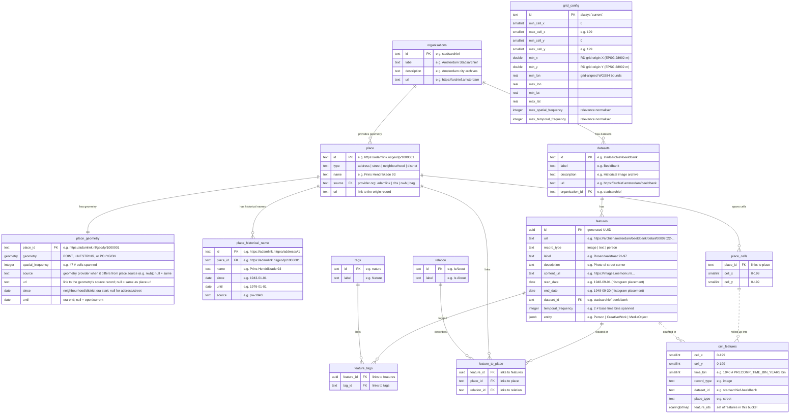

# [Amsterdam Time Machine Data Index](https://data.amsterdamtimemachine.nl)

The Amsterdam Time Machine [Data Index](https://data.amsterdamtimemachine.nl) provides location-based access to historical information about Amsterdam across centuries. It serves as a unified entry point to heritage collections from multiple Amsterdam and national institutions, connecting digitised sources through place and time.

The interface overlays Amsterdam with a spatial heatmap grid and a timeline spanning the 17th century to the present in configurable periods. Each grid cell shows the density of available data for that area and time period. Clicking a cell reveals the available images, texts, and person records from that neighbourhood. All results link directly to the original source at the holding institution.

Rather than curating or contextualising the data, the index presents sources as they are, including any OCR errors or metadata gaps. This makes visible not only what is documented but also what is missing, inviting critical reflection on digitisation practices and historical documentation.

## Table of contents

- [Stack](#stack)
  - [Data model](#data-model)
- [Indexing](#indexing)
  - [Spatial indexing](#spatial-indexing)
  - [Place data naming](#place-data-naming)
    - [Address place](#address-place)
    - [Street place](#street-place)
    - [Neighbourhood place](#neighbourhood-place)
    - [District place](#district-place)
    - [Place names at query time](#place-names-at-query-time)
  - [Temporal indexing](#temporal-indexing)
  - [Unique features rank higher](#unique-features-rank-higher)
- [Dating](#dating)
  - [Feature dates](#feature-dates)
  - [Place dates](#place-dates)
  - [Place name dates](#place-name-dates)
  - [Dates sources](#dates-sources)
  - [Dates resolution](#dates-resolution)
- [Data ingestion](#data-ingestion)
  - [Getting the data](#getting-the-data)
  - [Place data ingestion](#place-data-ingestion)
    - [Place datasets](#place-datasets)
  - [Minimum required fields per feature](#minimum-required-fields-per-feature)
  - [Adding a dataset](#adding-a-dataset)
  - [Re-ingesting and corrections](#re-ingesting-and-corrections)
- [API endpoints](#api-endpoints)
- [Development](#development)
  - [Prerequisites](#prerequisites)
  - [First time setup](#first-time-setup)
  - [Database UI](#database-ui)
  - [Testing](#testing)
- [Production](#production)
  - [Self-hosted setup](#self-hosted-setup)
  - [Existing Postgres setup](#existing-postgres-setup)
  - [Deploying a new image](#deploying-a-new-image)
  - [Adding a second deployment on the same host](#adding-a-second-deployment-on-the-same-host)
  - [Environment variables](#environment-variables)

## Stack

```
packages/
  shared/       TypeScript types and configuration
  db/           PostgreSQL 16 + PostGIS, Drizzle ORM, ETL scripts
  app/          SvelteKit 5, MapLibre GL, TailwindCSS
```

Runtime: Bun. Infrastructure: Docker Compose. Map tiles: OpenFreeMap.

### Data model



- **organisations**: Institutions that provide datasets, or place geometry (referenced by `place.source`)
- **datasets**: Data collections from organisations
- **place**: Physical location identity (id, type, name); `source` is the provider organisation
- **place_geometry**: A place's geometry (RD / EPSG:28992) and the period it was valid (1:1 with place)
- **place_historical_name**: Dated past names linked to places (addresses, streets), used to show what a location was called at a given time
- **tags**: Thematic categories (e.g. Nature, Transport, Living) assigned to features. Work in progress, generated via AI classification across datasets
- **features**: Images, texts, persons, or other content items linked to places and displayed in the UI
- **place_cells**: Pre-computed spatial grid that powers the heatmap. Each place is mapped to the 100m cells its geometry covers (one cell for a point, many for a street or neighbourhood). Features inherit cell coverage through their place link, cell assignments are stored once per place rather than duplicated per feature.
- **cell_features**: Which features occupy each cell, base time bin and category — the cell-major counterpart of `place_cells`, written by `rebuild-index`. It materialises the `features → feature_to_place → place → place_cells` hop plus the time bin, so the heatmap and histogram read one table instead of re-running that join per request. Each bucket holds its feature set as a **roaring bitmap** rather than a count: merging buckets is then a set union, which de-duplicates a feature spanning several cells or place types, so base cells can be rolled up into *any* display grid and still yield an exact distinct count. The bitmap stores a dense integer surrogate assigned during the rebuild (roaringbitmap holds int4; `features.id` is a 128-bit uuid) — only cardinality is ever read back, never identity, so the mapping is discarded.
- **grid_config**: Single row (`id = 'current'`) of grid metadata written by `rebuild-index`: the RD/28992 grid origin (`min_x`, `min_y`), the base-cell index extent, the WGS84 bounds of the cell grid, and the max spatial/temporal frequencies used to normalise relevance. Read once per heatmap/feature request.

## Indexing

The data index is restricted to historical features that can be both spatially located (linked to a place with geometry) and temporally located (with a date range). `rebuild-index` precomputes a fixed-resolution spatial grid and a fixed-resolution timeline once after ingestion; the UI then aggregates those base units into coarser display grids and histogram bins on demand.

### Spatial indexing

Each feature is linked to one or more `place` rows via `feature_to_place`. Each place stores a geometry (POINT, LINESTRING, or POLYGON) in **RD New (EPSG:28992, metres)**. Query responses reproject to **WGS84 (EPSG:4326)** before sending to the client. `rebuild-index` overlays the city with a regular grid of `PRECOMP_GRID_CELL_METERS`-wide cells (default 100m) whose origin is the south-west corner of the bounding box of all feature-linked `place` geometries, and writes the cells each of those feature-linked places covers to `place_cells` — one set of cells per place, not per feature. Places with no linked feature are skipped entirely, so ingesting unreferenced geometry (e.g. the present-day districts until a dataset uses them) adds no cells and never enlarges the grid. A point lands in one cell, a line in the cells it crosses, and a polygon is filled (its interior, not just its outline). These mappings are computed in PostGIS: points with `ST_DumpPoints`, lines and polygons by rasterising each candidate cell with `ST_Intersects` against its `ST_MakeEnvelope`. Features inherit cell coverage through their place link.

`rebuild-index` then rolls that join up into `cell_features`, one bucket per (base cell, base time bin, record type, dataset, place type), each holding the set of features it contains. Heatmap and histogram requests read only that table — filtering buckets and unioning their bitmaps — instead of re-joining `place_cells` → `feature_to_place` → `features` and computing `COUNT(DISTINCT feature_id)` on every request. The union is what makes it exact: a street spanning several base cells that fold into one display cell is counted once, so any display resolution can be served from the same buckets. On the full dataset that took the heatmap from ~13s to under a second.

The grid lives in RD metres: a cell index is `floor((coord − origin) / PRECOMP_GRID_CELL_METERS)`, so cell `(0,0)` is the 100m square at the origin. `rebuild-index` persists that origin (`min_x`, `min_y`) and the cell extent to the single-row `grid_config` table, together with the **WGS84 bounds of the grid rectangle** — the origin extended by `(maxCell + 1)` cells, reprojected to EPSG:4326. The frontend divides those grid-aligned bounds into display cells, so what it draws tiles the exact grid the counts were computed on rather than the looser data envelope; the reverse lookup (click a cell → list its features) inverts the same bounds, keeping hover counts and feature lists in agreement.

Heatmap density is rendered with log-normalised counts (`log(count+1) / log(maxCount+1)`).

### Place data naming 

Every `place` has a geometry and a `name`, and may have dated historical names in `place_historical_name`. How geometry and naming interact with the temporal index depends on geometry type and related data available in Adamlink. At the moment, a feature can link to only a single place. 

#### Address place
Address place is a single numbered city address such as Prins Henrikkade 15. It is represented by single `POINT` geometry. Each address is labelled by multiple historical names taken from `addressen.ttl`'s `rdfs:label`, each dated by its `sem:hasEarliestBeginTimeStamp` and `sem:hasLatestEndTimeStamp` fields. The `name` is derived from the most recent historical name. In the heatmap its point occupies a single grid cell.

#### Street place
Street place is a single street such as Prins Henrikkade. It is represented by single `LINESTRING` geometry. Each street is labelled by multiple historical names taken from the `rdfs:label` nested in `straten.ttl`'s `schema:name`, each dated by its `sem:hasEarliestBeginTimeStamp` and `sem:hasEarliestEndTimeStamp` fields. The `name` is extracted directly from `skos:prefLabel`. In the heatmap its line is rasterised to every cell it crosses. 

#### Neighbourhood place
Neighbourhood place is a small area of the city, such as Riekerpolder. It is represented by single `POLYGON` or `MULTIPOLYGON` geometry. Unlike addresses and streets it has no dated names; instead each era is its own place (each era redraws the city's division), the *geometry* dated by `buurten.ttl`'s `sem:hasEarliestBeginTimeStamp` and `sem:hasEarliestEndTimeStamp` fields. The `name` is extracted directly from `skos:prefLabel`. In the heatmap its polygon is rasterised, every cell its interior covers is filled.

#### District place
District place is a larger area that groups several neighbourhoods, such as Volewijck. It is identical to a neighbourhood in every respect (single `POLYGON` or `MULTIPOLYGON`, no dated names, `name` straight from `skos:prefLabel`) but coarser, and tagged `district`. It rasterises like a neighbourhood, but its larger area fills more cells — so district-linked features carry a higher `spatial_frequency` and rank as less spatially specific.

Adamlink supplies three neighbourhood systems (1850, 1909, and the present-day CBS buurten) and two district systems (1600 and the present-day CBS wijken). Each system is its own set of places with its own polygons, so unlike a street or address, whose single geometry holds across time a neighbourhood's or district's outline differs from one period to the next.

`buurten.ttl` carries no explicit wijk/buurt field, so the designation is **inferred**: present-day data units by their CBS code (`dc:identifier` `WK…` → district, `BU…` → neighbourhood), and historical units by their begin year (1600 → district, 1850/1909 → neighbourhood). That period-to-granularity mapping follows Adamlink's own [documentation of these systems](https://adamlink.nl/geo/districts) — the pre-1850 wijken, the 1850 and 1909 buurten — rather than any field in the data itself.

#### Place names at query time
The naming model above determines what the API returns per place type. `getFeatures` resolves a `historicalLabel` — the name a place held at the feature's date — by matching `place_historical_name` on `since`/`until`. Because **addresses and streets have dated names**, their features get a `historicalLabel` that reflects the feature's period; because **neighbourhoods and districts have no dated names**, their features fall back to the place's `displayName`. For a neighbourhood or district, then, period is never resolved by date — it is implicit in *which* era-place the feature was linked to at ingest (chosen by the dataset contributor), and the API only reflects that link.

### Temporal indexing

Each feature has `start_date` and `end_date`, both inclusive at the year level. A feature with `start_date=1900-06-15` and `end_date=1900-08-30` covers exactly the year 1900. Time is divided into base bins of `PRECOMP_TIME_BIN_YEARS` years (default 50), each spanning `[bin_start, bin_end)`: start year inclusive, end year exclusive. A feature is assigned to every bin its year range overlaps: a feature spanning 1900–1925 with 10-year bins falls into `[1900,1910)`, `[1910,1920)`, and `[1920,1930)`. Its `temporal_frequency` is the count of those bins (3 here).

The timeline (rendered as a histogram) uses the same overlap logic but at the display bin size requested by the client. Display bin size is clamped to `[DISPLAY_TIME_BIN_MIN_YEARS, DISPLAY_TIME_BIN_MAX_YEARS]` and rounded down to a multiple of `PRECOMP_TIME_BIN_YEARS` — the `cell_features` rollup stores counts per base bin, so a display bin has to be a whole number of them (a 25-year bin can't split a decade).

Timeline bar heights use the same log normalisation as the heatmap.

### Unique features rank higher

Indexing also stores two counters per feature. `spatial_frequency` counts the base cells a feature's place(s) touch. `temporal_frequency` counts the base bins its date range covers. They serve as a specificity signal: a photograph of one building on one day is more useful than a region-wide survey spanning centuries. Both are normalised by the dataset maximum and summed into a `relevance_score`:

```
relevance_score = spatial_frequency / max_spatial + temporal_frequency / max_temporal
```

Lower scores mean features more unique to the time and place.

## Dating

### Feature dates
Feature dates (`features.start_date` / `end_date`) are the source feature's own date range. They drive the histogram and heatmap, `temporal_frequency`, and thus an item's ranking.

### Place dates
Place dates (`place_geometry.since` / `until`) mark the period a neighbourhood or district geometry was the city's division — these are the only place types whose geometry changes over time, as documented in Adamlink. They're used at ingest to match a neighbourhood/district feature's date range to the geometry of the right era.
 
### Place name dates
Name dates (`place_historical_name.since` / `until`) record the period a historical name of an address or street was in use. They supply the `historicalLabel` shown on a feature. Adamlink provides historical names only for streets and addresses.

### Dates sources
**Feature dates** come from the source dataset's own fields, at ingest. **Name dates**
come from the Adamlink TTLs — `sem:hasEarliestBeginTimeStamp` / `hasLatestEndTimeStamp` on
address observations, and the `sem:` fields on a street's `schema:name` variants (see
[Place data naming](#place-data-naming)). 

**Place dates** come from `buurten.ttl`'s begin/end years for historical units (1600 wijken `[1600,1850)`, 1850 buurten
`[1850,1909)`, 1909 buurten `[1909,1921)`); **present-day CBS units carry no start - end dates, so they're
assigned an open-ended window back to their predecessor's end: CBS buurten from 1921, CBS
wijken from 1850.**

### Dates resolution

The full extent of the Data Index timeline is derived from the earliest date any feature starts to the latest date any feature ends. A feature in the Index belongs to every time bin its `[start, end]` time range overlaps. That overlap rule spreads one feature across many bins.

A street or address feature shows its historical name (from `place_historical_name`) with today's name (from `name`) in brackets when the two differ — a 1700 record of a street reads **Heiligeweg (nu Kalverstraat)**. A place with no dated name just shows its current `name`. The historical name is resolved at query time as the **most recent** `place_historical_name` whose `since` is ≤ the feature's `end_date` — the name in force when the feature ends. 

Neighbourhood and district geometry, unlike a street's or address's, changes across history: each era's division is its own `place` row with its own `place_geometry` (polygon + `[since, until)` window). Which era a feature attaches to is decided **at ingest, not query time** — it's linked to the `place` whose window overlaps the feature's `[start, end]` the most. At query time the heatmap then counts that feature against its historical geometry's footprint, **even though the basemap shows the modern city**.

A feature located by **coordinate** links to the place of its own era: addresses exist in two layers — historical Adamlink (up to 1943) and present-day BAG — so a feature dated before `ERA_CUTOFF` (1943) resolves to the Adamlink address, on/after it to the BAG address at the same point, always at the finest granularity that resolves (address > street > neighbourhood > district) within a per-type distance cap. A feature located by **name** instead resolves to the place whose name was in force nearest its date. Either way, a name matching two equally-plausible places, or a coordinate with nothing in range, is skipped rather than linked to a guess.

Both name- and geometry-windows run from `since` up to but not including `until` (at year granularity), so a boundary year falls in exactly one window; `until = null` means "still current".

## Data ingestion

### Getting the data

Ingestion reads files from a local data directory; how you obtain each differs by source:

- **Adamlink place data** — download the TTLs from [adamlink.nl/data](https://adamlink.nl/data): the neighbourhoods & districts, streets, LPS, and adressen files. Static, versioned downloads.
- **PDOK base registries (CBS / NWB / BAG)** — not downloaded by hand. `db:fetch` queries the [PDOK](https://www.pdok.nl) WFS and writes a ground-truth file:

  ```bash
  bun run db:fetch -s cbs-areas     -o <data-dir>/cbs-areas.geojson
  bun run db:fetch -s nwb-streets   -o <data-dir>/nwb-streets.geojson
  bun run db:fetch -s bag-addresses -o <data-dir>/bag-addresses.ndjson
  ```

  Splitting fetch from ingest keeps ingestion offline and reproducible and pins each PDOK snapshot as an inspectable file; re-run a fetch to refresh it.
- **Feature datasets (Beeldbank, Joods Monument, Delpher)** — currently private derivatives of mostly-public source collections, so they are not publicly distributable.

All files land in the data directory; the ingestion steps below read them.

### Place data ingestion

The project uses [Adamlink](https://adamlink.nl) as its geographic backbone. Adamlink is a Linked Open Data service that connects historical Amsterdam address registries to point geometries, enabling features to be linked to physical locations with historical address names.

Adamlink place data must be ingested before any dataset. See the [Development](#development) or [Production](#production) sections for the full ingestion order.

Adamlink is the backbone, but it doesn't cover everything — its addresses stop at 1943, it lacks Weesp's addresses and areas (its street layer does reach Weesp), and it misses some Amsterdam streets. Three national base registries fill those gaps (see [Place datasets](#place-datasets)), and every `place` row records its `source` (`adamlink` / `cbs` / `nwb` / `bag`) and a `url` to the origin record. A feature is skipped at ingest if it can't be resolved to an existing place, or if it lacks the stable source identifier its `id` is derived from — no feature row is created and nothing unlinked lands in the database.

If you are deploying this for **another Dutch city**, you can bypass Adamlink by having your ingestion scripts create `place` rows directly with your own IDs and geometries. A `WKT`-method source like `delpher.ts` shows how a dataset matches incoming coordinates to existing places; for creating new places, adapt the pattern from `lps.ts`. The core requirement is that each feature links to a `place` row that has a geometry.

For a city **outside the Netherlands** there is one more step: the Dutch national grid (RD / EPSG:28992) is hardcoded across the stack — the `place` geometry column, `insertPlaces`, `rebuild-index`, the grid-config and heatmap queries, and the frontend `proj4` definition — so you must swap that SRID for the target region's metric CRS in each of those spots and re-verify the grid math. RD is only valid over the Netherlands, so this step is unavoidable abroad.

#### Place datasets

Place data comes from two kinds of source, distinguished by the `source` column. **Adamlink** is the backbone — historical geometry and address history. Three **PDOK base registries** fill what Adamlink lacks, for Amsterdam and the annexed municipality of Weesp.

Adamlink (download the TTLs, see [Getting the data](#getting-the-data)):

| Dataset | Description | Format |
|---------|-------------|--------|
| [Neighbourhoods & districts](https://adamlink.nl/geo/districts) | Neighbourhood (buurt) + district (wijk) polygons — historical (1600 wijken, 1850/1909 buurten) plus present-day CBS — split onto the `neighbourhood` and `district` place types; ingested by the `neighbourhoods-and-districts` source | TTL |
| [Streets](https://adamlink.nl/data) | Street geometries (LINESTRING) with historical name variants | TTL |
| [LPS](https://adamlink.nl/data) | Linked point set: historical address-to-geometry mappings from 7 Amsterdam registries (1832–1976) | TTL |
| [Adressen](https://adamlink.nl/data) | Dated address observations linking to LPS points via `schema:geoContains` | TTL |

Three PDOK base registries fill the gaps, fetched with `db:fetch` (scope Amsterdam + Weesp — see [Getting the data](#getting-the-data)). CBS and BAG ingest via the generic `pdok-places` source; NWB has its own `nwb-streets` source that reconciles against Adamlink at ingest.

- **[CBS WijkenBuurten](https://service.pdok.nl/cbs/wijkenbuurten/2022/wfs/v1_0)** (`source` = `cbs`, GeoJSON) — Weesp's neighbourhoods (buurten) and districts (wijken), annexed by Amsterdam in 2022 and absent from Adamlink.
- **[NWB Wegen](https://service.pdok.nl/rws/nwbwegen/wfs/v1_0)** (`source` = `nwb`, GeoJSON) — the fetcher pulls *all* Amsterdam streets (incl. annexed Weesp); the `nwb-streets` ingest (`-x <adamlinkstraten.ttl>`, required) reconciles them against Adamlink by BAG openbare-ruimte id (`bagOrl` ↔ Adamlink `owl:sameAs`) and does two jobs:
  - **gap-fill** — streets absent from Adamlink become `nwb-<bagOrl>` places (`source` = `nwb`);
  - **backfill** — streets Adamlink *names* but has no line for keep their Adamlink id, name, and dated names, and borrow the NWB geometry; that borrowed line is recorded on `place_geometry.source` = `nwb` (with a link to the BAG record), so it reads as an Adamlink street with NWB geometry.

  Streets Adamlink already draws are skipped, as are NWB segments without a `bagOrl` (bridges/locks).
- **[BAG](https://service.pdok.nl/lv/bag/wfs/v2_0)** (`source` = `bag`, NDJSON) — current addresses; Adamlink's address history stops at 1943.

### Minimum required fields per feature

Each feature needs at minimum:
- **label**: Display name
- **record_type**: One of `image`, `text`, `person` (the frontend renders each type differently)
- **start_date** / **end_date**: Date range for temporal placement on the histogram
- **place link**: Each feature must be linked to one or more physical locations. If your data references Adamlink address or street IDs, the ingestion script resolves them to places via the `place_historical_name` table or `place` table. 

Optional: `description`, `content_url` (media), `entity` (schema.org JSONB), `url` (source link).

### Adding a dataset

A dataset is a subclass of `Ingestor` (`packages/db/src/etl/sources/ingestor.ts`) that declares its organisation/dataset metadata, a `transform` mapping each source row to a feature, and a `PLACE_EXTRACTION_METHODS` cascade — the ordered signals used to resolve each feature to a place, tried in turn until one resolves (else the feature is skipped and tallied by reason). Three signals are available:

- `WKT` — a coordinate, matched to the nearest era-appropriate place within a distance cap (see [Dates resolution](#dates-resolution))
- `TEXT` — a free-text field, scanned for known place names
- `URI` — an Adamlink place URI, matched exactly

Copy the existing source closest to your data and edit its metadata, `transform`, and methods:

- `delpher.ts` — coordinate (`WKT`) features
- `blogs.ts` — free-text (`TEXT`) features, place names scanned from the article body
- `beeldbank.ts` — Adamlink `URI` features, with an address-URI → street-URI fallback cascade
- `joods-monument.ts` — `URI` person features

Then run:

```bash
bun run db:ingest -s <dataset-name> -f <path-to-file>
bun run db:rebuild-index
```

`rebuild-index` computes spatial grid cells, the `cell_features` rollup the heatmap and histogram read, and frequency values. Must run after every data change — a feature ingested without it won't appear on the map.

### Re-ingesting and corrections

Ingestion is idempotent and source-driven: corrections are made in the **source file** and re-ingested, not by editing the database directly (a raw DB edit is overwritten the next time that source runs). Re-running an unchanged file is a no-op, a source that lists the same item twice dedups it by its natural key, and after any correction you run `bun run db:rebuild-index` to refresh the spatial grid and frequency counts.

**Fixing a feature.** A feature's id is a deterministic UUID derived from its dataset id plus the source's stable identifier (`featureUuid(datasetId, key)`); the dataset prefix keeps identical keys in different datasets from colliding. Editing a field in the source and re-ingesting that source upserts the existing row in place — `label`, `description`, `content_url`, dates, `entity`, and record type are all refreshed. A corrected place link is reconciled too: the feature's old `feature_to_place` rows are cleared and the new link replaces them rather than accumulating a second. Keep the source identifier stable — it is the key, so changing it creates a new feature and orphans the old one. Removing a feature is *not* automatic: a row dropped from the source file stays in the DB until you delete it by hand.

**Fixing a place.** Re-ingest the relevant place source (`lps`, `streets`, `neighbourhoods-and-districts`, or `adressen`). Place rows refresh under one of two conflict modes — streets, neighbourhoods, and districts overwrite everything including their label from the source (`replaceAll`), while addresses refresh only their geometry and keep the label the `adressen` step owns (`replaceGeometry`). So you re-ingest `lps` to correct an address's point without losing its name, and `adressen` to correct the name.

## API endpoints

| Endpoint | Purpose |
|----------|---------|
| `GET /api/metadata` | Time slices, record types, datasets, stats |
| `GET /api/heatmaps` | Sparse heatmap data with grid dimensions |
| `GET /api/histogram` | Feature count distribution by time period |
| `GET /api/features` | Paginated features within geographic bounds |
| `GET /api/available-tags` | Tags with feature counts |
| `GET /api/tag-combinations` | Valid next tags for a tag selection — progressive tag filtering (WIP, not yet exposed in the UI) |

Heatmaps, histogram, features, and available-tags accept `recordTypes`, `datasets`, and `placeTypes` (`address` / `street` / `neighbourhood` / `district`) query parameters to filter results.

## Development

### Prerequisites

- [Bun](https://bun.sh)
- [Docker](https://docker.com) with Docker Compose

### First time setup

```bash
bun install
cp .env.example .env

# Start bundled Postgres + PostGIS
bun run docker:db:up

# Push schema
bun run db:push-schema

# Ingest place data (required before any dataset)
bun run db:ingest -s neighbourhoods-and-districts -f <path-to-adamlinkbuurten.ttl>
bun run db:ingest -s streets -f <path-to-adamlinkstraten.ttl>
bun run db:ingest -s lps -f <path-to-lps.ttl>
bun run db:ingest -s adressen -f <path-to-adressen.ttl>

# PDOK gap-fills: fetch, then ingest
bun run db:fetch  -s cbs-areas     -o <data-dir>/cbs-areas.geojson
bun run db:fetch  -s nwb-streets   -o <data-dir>/nwb-streets.geojson
bun run db:fetch  -s bag-addresses -o <data-dir>/bag-addresses.ndjson
bun run db:ingest -s pdok-places -f <data-dir>/cbs-areas.geojson
bun run db:ingest -s nwb-streets -f <data-dir>/nwb-streets.geojson -x <data-dir>/adamlinkstraten.ttl
bun run db:ingest -s pdok-places -f <data-dir>/bag-addresses.ndjson

# Ingest datasets (any order)
bun run db:ingest -s <dataset-name> -f <path-to-file>

# Rebuild index
bun run db:rebuild-index

# Run the frontend
bun run dev    # http://localhost:5175
```

### Database UI

```bash
bun run db:studio    # http://local.drizzle.studio
```

### Testing

`bun run test` runs both suites via `turbo run test`: the **db** tests against an isolated Postgres+PostGIS container (port `5434`, ephemeral — wiped on `test:db:down`), and the **app** unit tests (pure heatmap/cell maths, no DB). The db integration tests exercise the pipeline end-to-end — LPS + adressen + streets + beeldbank + Joods Monument ingestion on real-data fixtures under `packages/db/src/__tests__/fixtures/`, then the query layer (features, heatmap, timeline, histogram) and `rebuild-index` — alongside pure-function unit tests for the query helpers.

```bash
bun run test:db:up     # start the isolated test DB (required for the db suite)
bun run test           # both suites via turbo (db + app)
bun run test:unit      # db pure-function tests only (no DB needed)
bun run test:db:down   # stop and wipe the test DB
```

## Production

The app runs from a prebuilt GHCR image — `:production` from `main`, `:staging` from
`staging`. Its database is either **self-hosted** (a bundled Postgres container) or an
**existing Postgres** you point it at. Both need PostGIS *and* `pg_roaringbitmap` (it backs
the `cell_features` rollup): the self-hosted image bundles both; an existing server needs
roaringbitmap added — see [Existing Postgres setup](#existing-postgres-setup).

Images build in CI on push once tests pass; pulling and restarting on the server is manual
— see [Deploying a new image](#deploying-a-new-image).

### Self-hosted setup

Bundled Postgres + PostGIS + `pg_roaringbitmap`; all code runs from the image (one clone
per deployment, on the branch matching its image tag). Shown for **production** — the
**Staging** note after the block covers the two differences.

```bash
ssh user@server

# Docker Engine + compose plugin (>= 2.24)
curl -fsSL https://get.docker.com | sh
sudo usermod -aG docker $USER      # log out and back in
docker compose version

git clone -b main git@github.com:amsterdamtimemachine/data-index.git ~/data-index-prod
cd ~/data-index-prod

cp .env.example .env                             # fill in per the Environment variables table below

# reuse $DC for every command below; for staging, swap production.yml → staging.yml
export DC="docker compose --env-file .env \
  -f docker/docker-compose.yml \
  -f docker/docker-compose.self-hosted.yml \
  -f docker/docker-compose.production.yml"

$DC pull dataindex-db
$DC up -d --wait dataindex-db
$DC pull app

$DC run --rm app bun run db:push-schema

# put the source files in DATA first (see "Getting the data"); paths are /data/… not $DATA/…. Run in tmux.
export DATA=/srv/atm-data
alias etl="$DC run --rm -v $DATA:/data:ro app bun run db:ingest"
alias fetch="$DC run --rm -v $DATA:/data app bun run db:fetch"

etl -s neighbourhoods-and-districts -f /data/adamlinkbuurten.ttl
etl -s streets  -f /data/adamlinkstraten.ttl
etl -s lps      -f /data/lps.ttl
etl -s adressen -f /data/adressen.ttl

# PDOK gap-fills: fetch, then ingest
fetch -s cbs-areas     -o /data/cbs-areas.geojson
fetch -s nwb-streets   -o /data/nwb-streets.geojson
fetch -s bag-addresses -o /data/bag-addresses.ndjson
etl -s pdok-places -f /data/cbs-areas.geojson
etl -s nwb-streets -f /data/nwb-streets.geojson -x /data/adamlinkstraten.ttl
etl -s pdok-places -f /data/bag-addresses.ndjson

etl -s beeldbank      -f /data/beeldbank.csv
etl -s joods-monument -f /data/results_jm.csv
etl -s delpher        -f /data/delpher_newspapers.csv

# required, or the map stays empty; raise DB_STATEMENT_TIMEOUT_MS in .env if it times out
$DC run --rm app bun run db:rebuild-index

$DC up -d app        # loopback only — front with a reverse proxy on 127.0.0.1:$APP_PORT
```

**Staging.** Same procedure, with two changes: clone `-b staging` (into e.g. `~/data-index-staging`) and use `docker/docker-compose.staging.yml` instead of `production.yml` — the overlays are identical apart from the image tag (`:staging` vs `:production`). If staging runs on the **same host** as production, also give its `.env` a distinct `COMPOSE_PROJECT_NAME` and a free `APP_PORT` / `DB_PORT` so the two don't collide — see [Adding a second deployment on the same host](#adding-a-second-deployment-on-the-same-host).

### Existing Postgres setup

Point the app at a Postgres you already run — no bundled DB container. It needs
`pg_roaringbitmap`; PostGIS you likely already have.

```bash
# 1. On the DB host — build pg_roaringbitmap from source against the server's Postgres major:
psql -c "SHOW server_version;"                    # note the major, e.g. 16
sudo apt-get install -y build-essential git postgresql-server-dev-16   # match the major
git clone --depth 1 --branch v1.2.0 https://github.com/ChenHuajun/pg_roaringbitmap.git
cd pg_roaringbitmap && make with_llvm=no && sudo make install with_llvm=no
psql -d <atm_db> -c "CREATE EXTENSION IF NOT EXISTS roaringbitmap;"    # superuser; no restart

# 2. On the app host — clone, configure, run schema + ETL against that DB.
git clone -b main git@github.com:amsterdamtimemachine/data-index.git ~/data-index-prod
cd ~/data-index-prod
cp .env.example .env                              # point DB_* at the existing server (reachable
                                                  # from the app container); rest per the table below

export DC="docker compose --env-file .env \
  -f docker/docker-compose.yml \
  -f docker/docker-compose.production.yml"

$DC config --services                             # should list only: app

$DC pull app
$DC run --rm app bun run db:push-schema
export DATA=/srv/atm-data
alias etl="$DC run --rm -v $DATA:/data:ro app bun run db:ingest"
alias fetch="$DC run --rm -v $DATA:/data app bun run db:fetch"
etl -s neighbourhoods-and-districts -f /data/adamlinkbuurten.ttl
etl -s streets  -f /data/adamlinkstraten.ttl
etl -s lps      -f /data/lps.ttl
etl -s adressen -f /data/adressen.ttl
# PDOK gap-fills: fetch, then ingest
fetch -s cbs-areas     -o /data/cbs-areas.geojson
fetch -s nwb-streets   -o /data/nwb-streets.geojson
fetch -s bag-addresses -o /data/bag-addresses.ndjson
etl -s pdok-places -f /data/cbs-areas.geojson
etl -s nwb-streets -f /data/nwb-streets.geojson -x /data/adamlinkstraten.ttl
etl -s pdok-places -f /data/bag-addresses.ndjson
etl -s beeldbank      -f /data/beeldbank.csv
etl -s joods-monument -f /data/results_jm.csv
etl -s delpher        -f /data/delpher_newspapers.csv
$DC run --rm app bun run db:rebuild-index

$DC up -d app
```

### Updating the app image

```bash
ssh user@server
cd ~/data-index-prod

export DC="docker compose --env-file .env \
  -f docker/docker-compose.yml \
  -f docker/docker-compose.self-hosted.yml \
  -f docker/docker-compose.production.yml"

$DC pull app
$DC up -d app                                    # recreates app only; the bundled DB is untouched

# only if the new image changed the schema or ingestors:
$DC run --rm app bun run db:push-schema
$DC run --rm -v $DATA:/data:ro app bun run db:ingest -s <source> -f /data/<file>
$DC run --rm app bun run db:rebuild-index

# to move the bundled DB to a newer image too:
$DC pull dataindex-db && $DC up -d --wait dataindex-db
$DC exec dataindex-db update-postgis.sh          # only if the PostGIS minor changed
```

Only the `app` service is named, so `pull`/`up -d app` leaves a bundled DB running and its volume untouched.

### Adding a second deployment on the same host

Repeat a setup section in a second clone: the other branch, its own `.env` with a distinct
`COMPOSE_PROJECT_NAME` and free `APP_PORT` / `DB_PORT`, and `production.yml` in place of
`staging.yml`. Nothing is shared — separate volumes, container names and ports — so the
order you set them up in doesn't matter, and neither does the `-f` overlay order.

### Environment variables

| Variable | Required | Default | Description |
|----------|----------|---------|-------------|
| `COMPOSE_PROJECT_NAME` | No | `docker` | Names this deployment's containers, network and volumes. Compose otherwise derives it from `docker/`, so two deployments on one host would collide — set a distinct value per deployment |
| `DB_HOST` | Yes | `localhost` | PostgreSQL host (use `localhost` when workstation CLI hits the self-hosted DB; use the remote host for external DB). The self-hosted overlay overrides this to `dataindex-db` for the app container |
| `DB_PORT` | No | `5432` | PostgreSQL port |
| `DB_USER` | Yes | `atm` | PostgreSQL user |
| `DB_PASSWORD` | Yes | `atm_dev_password` | PostgreSQL password |
| `DB_NAME` | Yes | `amsterdam_time_machine` | PostgreSQL database name |
| `APP_PORT` | No | `3000` | App port on host |
| `PUBLIC_DEFAULT_CENTER` | No | - | Map centre (WGS84 `lon,lat`) auto-selected on load, resolved to the cell containing it |
| `PUBLIC_TILE_SOURCE_URL` | No | OpenFreeMap | Vector tile source URL |
| `PUBLIC_EXACT_CELLS` | No | `false` | Reproject heatmap cells to their exact RD footprint via proj4 (removes the ~0.4° skew); default draws axis-aligned rectangles |
| `PRECOMP_TIME_BIN_YEARS` | No | `50` | Base time bin size (years). Shapes the `cell_features` buckets, so changing it requires a `db:rebuild-index` — the queries would otherwise fold base bins at the new width against buckets stored at the old one. Also caps time granularity: a requested `binSize` is rounded down to a multiple of this |
| `PRECOMP_GRID_CELL_METERS` | No | `100` | Base spatial cell size (meters) |
| `DISPLAY_GRID_DEFAULT_COLS` | No | `125` | Default heatmap grid width (columns); rows are derived from the data's aspect ratio so cells are square |
| `DISPLAY_GRID_MIN_COLS` / `DISPLAY_GRID_MAX_COLS` | No | `10` / `200` | Grid width (column count) bounds |
| `DISPLAY_TIME_BIN_DEFAULT_YEARS` | No | `50` | Default display bin size (years) |
| `DISPLAY_TIME_BIN_MIN_YEARS` / `DISPLAY_TIME_BIN_MAX_YEARS` | No | `10` / `100` | Bin size bounds (years) |
| `ADDRESS_MAX_DISTANCE_M` | No | `30` | Max metres a feature's coordinate may sit from an address before it won't link to it |
| `STREET_MAX_DISTANCE_M` | No | `50` | Same, for streets (areas link by containment, no radius) |
| `ERA_CUTOFF` | No | `1943-01-01` | Historical↔present address boundary: a feature dated before this resolves to an Adamlink address, on/after to a BAG one |
| `CURRENT_ANCHOR` | No | `2020-01-01` | Present-day reference date for scoring current place names |
| `CACHE_TTL_MINUTES` | No | `10` | TTL for cached DB queries |
