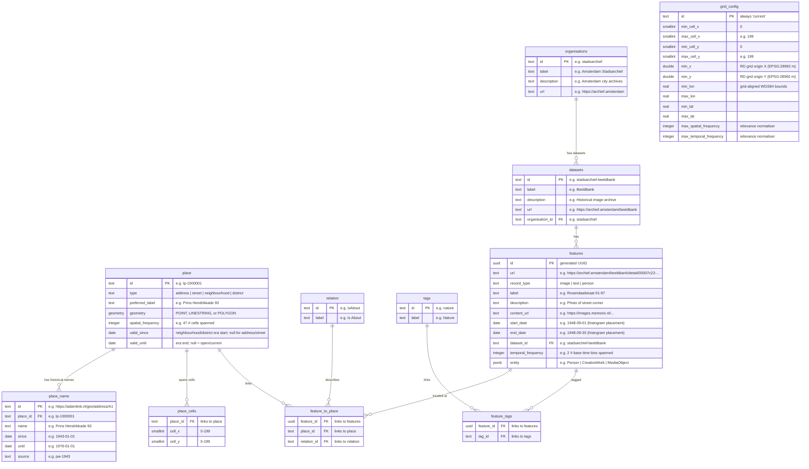

# [Amsterdam Time Machine Data Index](https://data.amsterdamtimemachine.nl)

The Amsterdam Time Machine [Data Index](https://data.amsterdamtimemachine.nl) provides location-based access to historical information about Amsterdam across centuries. It serves as a unified entry point to heritage collections from multiple Amsterdam and national institutions, connecting digitised sources through place and time.

The interface overlays Amsterdam with a spatial heatmap grid and a timeline spanning the 17th century to the present in configurable periods. Each grid cell shows the density of available data for that area and time period. Clicking a cell reveals the available images, texts, and person records from that neighbourhood. All results link directly to the original source at the holding institution.

Rather than curating or contextualising the data, the index presents sources as they are, including any OCR errors or metadata gaps. This makes visible not only what is documented but also what is missing, inviting critical reflection on digitisation practices and historical documentation.

## Table of contents

- [Architecture](#architecture)
  - [Data model](#data-model)
- [Indexing](#indexing)
  - [Spatial indexing](#spatial-indexing)
  - [Place data naming](#place-data-naming)
    - [Address place](#address-place)
    - [Street place](#street-place)
    - [Neighbourhood place](#neighbourhood-place)
    - [District place](#district-place)
    - [Place names at query time](#place-names-at-query-time)
  - [Temporal indexing](#temporal-indexing)
  - [Unique features rank higher](#unique-features-rank-higher)
- [Dating](#dating)
  - [Where the dates come from](#where-the-dates-come-from)
  - [How dates resolve](#how-dates-resolve)
- [Data ingestion](#data-ingestion)
  - [Place data ingestion](#place-data-ingestion)
    - [Place datasets](#place-datasets)
  - [Minimum required fields per feature](#minimum-required-fields-per-feature)
  - [Adding a dataset](#adding-a-dataset)
  - [Re-ingesting and corrections](#re-ingesting-and-corrections)
- [API endpoints](#api-endpoints)
- [Development](#development)
  - [Prerequisites](#prerequisites)
  - [First time setup](#first-time-setup)
  - [Database UI](#database-ui)
  - [Testing](#testing)
- [Production](#production)
  - [First time server setup (external DB)](#first-time-server-setup-external-db)
    - [Adding staging alongside](#adding-staging-alongside)
  - [First time server setup (self-hosted)](#first-time-server-setup-self-hosted)
  - [CI/CD](#cicd)
  - [Deploying a new image](#deploying-a-new-image)
  - [Environment variables](#environment-variables)

## Architecture

```
packages/
  shared/       TypeScript types and configuration
  db/           PostgreSQL 16 + PostGIS 3.4, Drizzle ORM, ETL scripts
  app/          SvelteKit 5, MapLibre GL, TailwindCSS
```

Runtime: Bun. Infrastructure: Docker Compose. Map tiles: OpenFreeMap.

### Data model



- **organisations**: Institutions that provide datasets
- **datasets**: Data collections from organisations
- **place**: Physical locations stored in RD coordinates (EPSG:28992)
- **place_name**: Historical names linked to places (addresses, streets), used to show what a location was called at a given time
- **tags**: Thematic categories (e.g. Nature, Transport, Living) assigned to features. Work in progress, generated via AI classification across datasets
- **features**: Images, texts, persons, or other content items linked to places and displayed in the UI
- **place_cells**: Pre-computed spatial grid that powers the heatmap. Each place is mapped to the 100m cells its geometry covers (one cell for a point, many for a street or neighbourhood). Features inherit cell coverage through their place link, cell assignments are stored once per place rather than duplicated per feature.
- **grid_config**: Single row (`id = 'current'`) of grid metadata written by `rebuild-index`: the RD/28992 grid origin (`min_x`, `min_y`), the base-cell index extent, the WGS84 bounds of the cell grid, and the max spatial/temporal frequencies used to normalise relevance. Read once per heatmap/feature request.

## Indexing

The data index is restricted to historical features that can be both spatially located (linked to a place with geometry) and temporally located (with a date range). `rebuild-index` precomputes a fixed-resolution spatial grid and a fixed-resolution timeline once after ingestion; the UI then aggregates those base units into coarser display grids and histogram bins on demand.

### Spatial indexing

Each feature is linked to one or more `place` rows via `feature_to_place`. Each place stores a geometry (POINT, LINESTRING, or POLYGON) in **RD New (EPSG:28992, metres)**. Query responses reproject to **WGS84 (EPSG:4326)** before sending to the client. `rebuild-index` overlays the city with a regular grid of `CELL_SIZE_METERS`-wide cells (default 100m) whose origin is the south-west corner of the bounding box of all feature-linked `place` geometries, and writes the cells each of those feature-linked places covers to `place_cells` — one set of cells per place, not per feature. Places with no linked feature are skipped entirely, so ingesting unreferenced geometry (e.g. the present-day districts until a dataset uses them) adds no cells and never enlarges the grid. A point lands in one cell, a line in the cells it crosses, and a polygon is filled (its interior, not just its outline). These mappings are computed in PostGIS: points with `ST_DumpPoints`, lines and polygons by rasterising each candidate cell with `ST_Intersects` against its `ST_MakeEnvelope`. Features inherit cell coverage through their place link. Heatmap requests join `place_cells` → `feature_to_place` → `features` and compute `COUNT(DISTINCT feature_id)` per cell, instead of scanning every feature row.

The grid lives in RD metres: a cell index is `floor((coord − origin) / CELL_SIZE_METERS)`, so cell `(0,0)` is the 100m square at the origin. `rebuild-index` persists that origin (`min_x`, `min_y`) and the cell extent to the single-row `grid_config` table, together with the **WGS84 bounds of the grid rectangle** — the origin extended by `(maxCell + 1)` cells, reprojected to EPSG:4326. The frontend divides those grid-aligned bounds into display cells, so what it draws tiles the exact grid the counts were computed on rather than the looser data envelope; the reverse lookup (click a cell → list its features) inverts the same bounds, keeping hover counts and feature lists in agreement.

Heatmap density is rendered with log-normalised counts (`log(count+1) / log(maxCount+1)`).

### Place data naming 

Every `place` has a geometry and a `preferred_label`, and may have dated historical names in `place_name`. How geometry and naming interact with the temporal index depends on geometry type and related data available in Adamlink. At the moment, a feature can link to only a single place. 

#### Address place
Address place is a single numbered city address such as Prins Henrikkade 15. It is represented by single `POINT` geometry. Each address is labelled by multiple historical names taken from `addressen.ttl`'s `rdfs:label`, each dated by its `sem:hasEarliestBeginTimeStamp` and `sem:hasLatestEndTimeStamp` fields. The `preferred_label` is derived from the most recent historical name. In the heatmap its point occupies a single grid cell.

#### Street place
Street place is a single street such as Prins Henrikkade. It is represented by single `LINESTRING` geometry. Each street is labelled by multiple historical names taken from the `rdfs:label` nested in `straten.ttl`'s `schema:name`, each dated by its `sem:hasEarliestBeginTimeStamp` and `sem:hasEarliestEndTimeStamp` fields. The `preferred_label` is extracted directly from `skos:prefLabel`. In the heatmap its line is rasterised to every cell it crosses. 

#### Neighbourhood place
Neighbourhood place is a small area of the city, such as Riekerpolder. It is represented by single `POLYGON` or `MULTIPOLYGON` geometry. Unlike addresses and streets it has no dated names; instead each era is its own place (each era redraws the city's division), the *geometry* dated by `buurten.ttl`'s `sem:hasEarliestBeginTimeStamp` and `sem:hasEarliestEndTimeStamp` fields. The `preferred_label` is extracted directly from `skos:prefLabel`. In the heatmap its polygon is rasterised, every cell its interior covers is filled.

#### District place
District place is a larger area that groups several neighbourhoods, such as Volewijck. It is identical to a neighbourhood in every respect (single `POLYGON` or `MULTIPOLYGON`, no dated names, `preferred_label` straight from `skos:prefLabel`) but coarser, and tagged `district`. It rasterises like a neighbourhood, but its larger area fills more cells — so district-linked features carry a higher `spatial_frequency` and rank as less spatially specific.

Adamlink supplies three neighbourhood systems (1850, 1909, and the present-day CBS buurten) and two district systems (1600 and the present-day CBS wijken). Each system is its own set of places with its own polygons, so unlike a street or address, whose single geometry holds across time a neighbourhood's or district's outline differs from one period to the next.

`buurten.ttl` carries no explicit wijk/buurt field, so the designation is **inferred**: present-day data units by their CBS code (`dc:identifier` `WK…` → district, `BU…` → neighbourhood), and historical units by their begin year (1600 → district, 1850/1909 → neighbourhood). That period-to-granularity mapping follows Adamlink's own [documentation of these systems](https://adamlink.nl/geo/districts) — the pre-1850 wijken, the 1850 and 1909 buurten — rather than any field in the data itself.

#### Place names at query time
The naming model above determines what the API returns per place type. `getFeatures` resolves a `historicalLabel` — the name a place held at the feature's date — by matching `place_name` on `since`/`until`. Because **addresses and streets have dated names**, their features get a `historicalLabel` that reflects the feature's period; because **neighbourhoods and districts have no dated names**, their features fall back to the place's `preferredLabel`. For a neighbourhood or district, then, period is never resolved by date — it is implicit in *which* era-place the feature was linked to at ingest (chosen by the dataset contributor), and the API only reflects that link.

### Temporal indexing

Each feature has `start_date` and `end_date`, both inclusive at the year level. A feature with `start_date=1900-06-15` and `end_date=1900-08-30` covers exactly the year 1900. Time is divided into base bins of `BASE_BIN_SIZE` years (default 10), each spanning `[bin_start, bin_end)`: start year inclusive, end year exclusive. A feature is assigned to every bin its year range overlaps: a feature spanning 1900–1925 with 10-year bins falls into `[1900,1910)`, `[1910,1920)`, and `[1920,1930)`. Its `temporal_frequency` is the count of those bins (3 here).

The timeline (rendered as a histogram) uses the same overlap logic but at the display bin size requested by the client. Display bin size is clamped to `[BIN_SIZE_MIN, BIN_SIZE_MAX]`.

Timeline bar heights use the same log normalisation as the heatmap.

### Unique features rank higher

Indexing also stores two counters per feature. `spatial_frequency` counts the base cells a feature's place(s) touch. `temporal_frequency` counts the base bins its date range covers. They serve as a specificity signal: a photograph of one building on one day is more useful than a region-wide survey spanning centuries. Both are normalised by the dataset maximum and summed into a `relevance_score`:

```
relevance_score = spatial_frequency / max_spatial + temporal_frequency / max_temporal
```

Lower scores mean features more unique to the time and place.

## Dating

The index carries dates on three different things, for three different purposes. Keeping
them distinct is what lets a 1950 photo of a 17th-century street show the period name on
a present-day map.

| Dates | Column(s) | What they mean | Used for |
|---|---|---|---|
| **Feature** | `features.start_date` / `end_date` | the source item's own date range | all temporal display: histogram, timeline, heatmap slices, `temporal_frequency`, ranking |
| **Name** | `place_name.since` / `until` | when a historical name was in use (addresses, streets) | the `historicalLabel` shown for a feature |
| **Place era** | `place.valid_since` / `valid_until` | the period a neighbourhood/district geometry *was* the city's division (null for address/street) | routing an area feature to the right-era polygon at ingest |

### Where the dates come from
- **Feature dates** — from the source dataset's own fields, at ingest.
- **Name dates** — from the Adamlink TTLs: `sem:hasEarliestBeginTimeStamp` / `hasLatestEndTimeStamp` on address observations, and the `sem:` fields on a street's `schema:name` variants (see [Place data naming](#place-data-naming)).
- **Place-era dates** — historical units from `buurten.ttl`'s begin/end years (1600 wijken `[1600,1850)`, 1850 buurten `[1850,1909)`, 1909 buurten `[1909,1921)`); present-day CBS units carry none, so they're assigned an open-ended window back to their predecessor's end (CBS buurten from 1921, CBS wijken from 1850).

### How dates resolve
- **Overlap on the full range is the default.** A feature belongs to every time bin/slice its `[start, end]` range overlaps — `year(start) < to AND year(end) >= from`. This drives the histogram, timeline, heatmap slices, the `getFeatures` time filter, and `temporal_frequency` (the span); the overall time range is `MIN(start)…MAX(end)`.
- **Two single-value exceptions:**
  - `historicalLabel` — the name in force at the feature's **end** date (latest `place_name.since <= end_date`).
  - neighbourhood/district era-routing — the era whose window **overlaps the feature's range the most**, so a boundary-straddler attaches to the era it spent most of its span in.
- Intervals are **half-open `[since, until)`** at **year** granularity; `valid_until = null` means open/current.

## Data ingestion

### Place data ingestion

The project uses [Adamlink](https://adamlink.nl) as its geographic backbone. Adamlink is a Linked Open Data service that connects historical Amsterdam address registries to point geometries, enabling features to be linked to physical locations with historical address names.

Adamlink place data must be ingested before any dataset. See the [Development](#development) or [Production](#production) sections for the full ingestion order.

Every `place` row is sourced from Adamlink. Features that can't be resolved to an existing Adamlink place are skipped at ingest; no feature row is created and nothing unlinked lands in the database.

If you are deploying this for **another Dutch city**, you can bypass Adamlink by having your ingestion scripts create `place` rows directly with your own IDs and geometries. The `geometry-point-template.ts` example shows how to match incoming coordinates to existing places; for creating new places, adapt the pattern from `lps.ts`. The core requirement is that each feature links to a `place` row that has a geometry.

For a city **outside the Netherlands** there is one more step: the Dutch national grid (RD / EPSG:28992) is hardcoded across the stack — the `place` geometry column, `insertPlaces`, `rebuild-index`, the grid-config and heatmap queries, and the frontend `proj4` definition — so you must swap that SRID for the target region's metric CRS in each of those spots and re-verify the grid math. RD is only valid over the Netherlands, so this step is unavoidable abroad.

#### Place datasets

All place geometry comes from these public Adamlink datasets.

| Dataset | Description | Format |
|---------|-------------|--------|
| [Neighbourhoods & districts](https://adamlink.nl/geo/districts) | Neighbourhood (buurt) + district (wijk) polygons — historical (1600 wijken, 1850/1909 buurten) plus present-day CBS — split onto the `neighbourhood` and `district` place types; ingested by the `neighbourhoods-and-districts` source | TTL |
| [Streets](https://adamlink.nl/data) | Street geometries (LINESTRING) with historical name variants | TTL |
| [LPS](https://adamlink.nl/data) | Linked point set: historical address-to-geometry mappings from 7 Amsterdam registries (1832–1976) | TTL |
| [Adressen](https://adamlink.nl/data) | Dated address observations linking to LPS points via `schema:geoContains` | TTL |

### Minimum required fields per feature

Each feature needs at minimum:
- **label**: Display name
- **record_type**: One of `image`, `text`, `person` (the frontend renders each type differently)
- **start_date** / **end_date**: Date range for temporal placement on the histogram
- **place link**: Each feature must be linked to one or more physical locations. If your data references Adamlink address or street IDs, the ingestion script resolves them to places via the `place_name` table or `place` table. 

Optional: `description`, `content_url` (media), `entity` (schema.org JSONB), `url` (source link).

### Adding a dataset

1. Pick a template from `packages/db/src/etl/examples/`: 
   - `adamlink-point-template.ts` for data referencing Adamlink address URIs
   - `geometry-point-template.ts` for data without Adamlink references (matches coordinates to nearest place)
   - `neighbourhood-template.ts` for area-level data (matches a buurt/wijk by name + date to the right era)
2. Copy it to `packages/db/src/etl/sources/<your-dataset>.ts`
3. Update organisation, dataset, relation, and field mappings
4. Run:

```bash
bun run db:ingest -s <dataset-name> -f <path-to-file>
bun run db:rebuild-index
```

`rebuild-index` computes spatial grid cells and frequency values. Must run after every data change.

### Re-ingesting and corrections

Ingestion is idempotent and source-driven: corrections are made in the **source file** and re-ingested, not by editing the database directly (a raw DB edit is overwritten the next time that source runs). Re-running an unchanged file is a no-op, a source that lists the same item twice dedups it by its natural key, and after any correction you run `bun run db:rebuild-index` to refresh the spatial grid and frequency counts.

**Fixing a feature.** A feature's id is derived from its source URL (`featureUuid`), so editing a field in the source and re-ingesting that source upserts the existing row in place — `label`, `description`, `content_url`, dates, `entity`, and record type are all refreshed. A corrected place link is reconciled too: the feature's old `feature_to_place` rows are cleared and the new link replaces them rather than accumulating a second. Keep the source URL stable — it is the key, so changing it creates a new feature and orphans the old one. Removing a feature is *not* automatic: a row dropped from the source file stays in the DB until you delete it by hand.

**Fixing a place.** Re-ingest the relevant place source (`lps`, `streets`, `neighbourhoods-and-districts`, or `adressen`). Place rows refresh under one of two conflict modes — streets, neighbourhoods, and districts overwrite everything including their label from the source (`replaceAll`), while addresses refresh only their geometry and keep the label the `adressen` step owns (`replaceGeometry`). So you re-ingest `lps` to correct an address's point without losing its name, and `adressen` to correct the name.

## API endpoints

| Endpoint | Purpose |
|----------|---------|
| `GET /api/metadata` | Time slices, record types, datasets, stats |
| `GET /api/heatmaps` | Sparse heatmap data with grid dimensions |
| `GET /api/histogram` | Feature count distribution by time period |
| `GET /api/features` | Paginated features within geographic bounds |
| `GET /api/available-tags` | Tags with feature counts |
| `GET /api/tag-combinations` | Valid next tags for a tag selection — progressive tag filtering (WIP, not yet exposed in the UI) |

Heatmaps, histogram, features, and available-tags accept `recordTypes`, `datasets`, and `placeTypes` (`address` / `street` / `neighbourhood` / `district`) query parameters to filter results.

## Development

### Prerequisites

- [Bun](https://bun.sh)
- [Docker](https://docker.com) with Docker Compose

### First time setup

```bash
bun install
cp .env.example .env

# Start bundled Postgres + PostGIS
bun run docker:db:up

# Push schema
bun run db:push-schema

# Ingest place data (required before any dataset)
bun run db:ingest -s neighbourhoods-and-districts -f <path-to-adamlinkbuurten.ttl>
bun run db:ingest -s streets -f <path-to-adamlinkstraten.ttl>
bun run db:ingest -s lps -f <path-to-lps.ttl>
bun run db:ingest -s adressen -f <path-to-adressen.ttl>

# Ingest datasets (any order)
bun run db:ingest -s <dataset-name> -f <path-to-file>

# Rebuild index
bun run db:rebuild-index

# Run the frontend
bun run dev    # http://localhost:5175
```

### Database UI

```bash
bun run db:studio    # http://local.drizzle.studio
```

### Testing

Tests run against an isolated Postgres+PostGIS container (port `5434`, tmpfs volume, data wiped on restart). Integration tests exercise the full pipeline end-to-end: LPS + adressen + beeldbank + Joods Monument ingestion on real-data fixtures under `packages/db/src/__tests__/fixtures/`, then the query layer (features, heatmap, timeline, histogram) and `rebuild-index`.

```bash
bun run test:db:up     # start the isolated test DB
bun run test           # full suite (64 tests: 24 unit + 40 integration)
bun run test:unit      # unit tests only (no DB needed)
bun run test:db:down   # stop and wipe the test DB
```

## Production

The app needs a PostgreSQL + PostGIS database. In production there is **External DB** mode where Data index connects to an existing DB, and **self-hosted** mode where a Postgres container is bundled alongside the app container.

### First time server setup (external DB)

```bash
ssh user@server

# Install Bun
curl -fsSL https://bun.sh/install | bash

# Clone repo
git clone git@github.com:amsterdamtimemachine/data-index.git ~/data-index && cd ~/data-index
bun install

# Set up production env (point at the existing Postgres server)
cp .env.example .env.prod
# Edit .env.prod: set DB_HOST / DB_PORT / DB_USER / DB_PASSWORD / DB_NAME to
# match the production database, and set APP_PORT (defaults to 3000).
# The app does NOT manage this server; assume it's already running and
# reachable from the VPS.

# Push schema into the existing DB (uses .env.prod via Bun's --env-file flag)
bun --env-file=.env.prod run db:push-schema

# Ingest place data (same env file)
bun --env-file=.env.prod run db:ingest -s neighbourhoods-and-districts -f <path-to-adamlinkbuurten.ttl>
bun --env-file=.env.prod run db:ingest -s streets -f <path-to-adamlinkstraten.ttl>
bun --env-file=.env.prod run db:ingest -s lps -f <path-to-lps.ttl>
bun --env-file=.env.prod run db:ingest -s adressen -f <path-to-adressen.ttl>

# Ingest feature datasets
bun --env-file=.env.prod run db:ingest -s beeldbank -f <path-to-beeldbank.csv>
bun --env-file=.env.prod run db:ingest -s joods-monument -f <path-to-results_jm.csv>
bun --env-file=.env.prod run db:ingest -s delpher -f <path-to-delpher_newspapers.csv>
bun --env-file=.env.prod run db:rebuild-index

# Start the app (connects to the external DB defined in .env.prod)
docker compose --project-name data-index-prod --env-file .env.prod \
  -f docker/docker-compose.yml \
  -f docker/docker-compose.production.yml up -d app
```

`--project-name data-index-prod` is necessary if you're running a staging deployment alongside. See below.

#### Adding staging alongside

```bash
cp .env.example .env.staging
# Edit .env.staging:
#   - DB_* → point at a staging Postgres (don't reuse production's DB)
#   - APP_PORT=3001 (or any free port ≠ production's)

# Push schema + ingest into the staging DB
bun --env-file=.env.staging run db:push-schema
bun --env-file=.env.staging run db:ingest -s neighbourhoods-and-districts -f <path-to-adamlinkbuurten.ttl>
bun --env-file=.env.staging run db:ingest -s streets -f <path-to-adamlinkstraten.ttl>
bun --env-file=.env.staging run db:ingest -s lps -f <path-to-lps.ttl>
# …and the other datasets, same pattern as production…
bun --env-file=.env.staging run db:rebuild-index

# Start the staging container alongside production
docker compose --project-name data-index-staging --env-file .env.staging \
  -f docker/docker-compose.yml \
  -f docker/docker-compose.staging.yml up -d app
```

### First time server setup (self-hosted)

```bash
ssh user@server

# Install Bun
curl -fsSL https://bun.sh/install | bash

# Clone repo
git clone git@github.com:amsterdamtimemachine/data-index.git ~/data-index && cd ~/data-index
bun install

# Set up production env (defaults target the bundled DB)
cp .env.example .env.prod
# Edit .env.prod: change DB_PASSWORD (and DB_USER / DB_NAME if you want).
# Leave DB_HOST=localhost (workstation CLI hits the mapped DB port; the
# self-hosted overlay overrides DB_HOST for the app container internally).

# Start the bundled Postgres + PostGIS (production overlay binds it to loopback)
docker compose --project-name data-index-prod --env-file .env.prod \
  -f docker/docker-compose.yml \
  -f docker/docker-compose.self-hosted.yml \
  -f docker/docker-compose.production.yml up -d dataindex-db

# Push schema
bun --env-file=.env.prod run db:push-schema

# Ingest place data
bun --env-file=.env.prod run db:ingest -s neighbourhoods-and-districts -f <path-to-adamlinkbuurten.ttl>
bun --env-file=.env.prod run db:ingest -s streets -f <path-to-adamlinkstraten.ttl>
bun --env-file=.env.prod run db:ingest -s lps -f <path-to-lps.ttl>
bun --env-file=.env.prod run db:ingest -s adressen -f <path-to-adressen.ttl>

# Ingest feature datasets
bun --env-file=.env.prod run db:ingest -s beeldbank -f <path-to-beeldbank.csv>
bun --env-file=.env.prod run db:ingest -s joods-monument -f <path-to-results_jm.csv>
bun --env-file=.env.prod run db:ingest -s delpher -f <path-to-delpher_newspapers.csv>
bun --env-file=.env.prod run db:rebuild-index

# Start the app container alongside the DB
docker compose --project-name data-index-prod --env-file .env.prod \
  -f docker/docker-compose.yml \
  -f docker/docker-compose.self-hosted.yml \
  -f docker/docker-compose.production.yml up -d app
```

### CI/CD

Two workflows publish images to GitHub Container Registry (GHCR). Both run the full test suite (inside a PostGIS service container) and only push if tests pass. Neither deploys to the server. Pulling and restarting is a manual step, which keeps the server's SSH surface private.

| Branch | Workflow | Image tags |
|---|---|---|
| `main` | `.github/workflows/production.yml` | `production`, `production-<sha>` |
| `staging` | `.github/workflows/staging.yml` | `staging`, `staging-<sha>` |

Use `staging` to test a build before merging to `main`: push your branch into `staging`, wait for the workflow, then pull the staging image on the VPS to verify.

### Deploying a new image

Each deployment is scoped by `--project-name` and reads its own `--env-file` so production and staging don't collide.

```bash
ssh user@server
cd ~/data-index

# Log in to GHCR (one-time, or when token expires)
echo $GHCR_TOKEN | docker login ghcr.io -u <github-user> --password-stdin

# Production
docker compose --project-name data-index-prod --env-file .env.prod \
  -f docker/docker-compose.yml \
  -f docker/docker-compose.production.yml pull app
docker compose --project-name data-index-prod --env-file .env.prod \
  -f docker/docker-compose.yml \
  -f docker/docker-compose.production.yml up -d app

# Staging
docker compose --project-name data-index-staging --env-file .env.staging \
  -f docker/docker-compose.yml \
  -f docker/docker-compose.staging.yml pull app
docker compose --project-name data-index-staging --env-file .env.staging \
  -f docker/docker-compose.yml \
  -f docker/docker-compose.staging.yml up -d app
```

### Environment variables

| Variable | Required | Default | Description |
|----------|----------|---------|-------------|
| `DB_HOST` | Yes | `localhost` | PostgreSQL host (use `localhost` when workstation CLI hits the self-hosted DB; use the remote host for external DB) |
| `DB_PORT` | No | `5432` | PostgreSQL port |
| `DB_USER` | Yes | `atm` | PostgreSQL user |
| `DB_PASSWORD` | Yes | `atm_dev_password` | PostgreSQL password |
| `DB_NAME` | Yes | `amsterdam_time_machine` | PostgreSQL database name |
| `APP_PORT` | No | `3000` | App port on host |
| `PUBLIC_DEFAULT_CELL` | No | - | Default cell to select on load |
| `PUBLIC_TILE_SOURCE_URL` | No | OpenFreeMap | Vector tile source URL |
| `PUBLIC_EXACT_CELLS` | No | `false` | Reproject heatmap cells to their exact RD footprint via proj4 (removes the ~0.4° skew); default draws axis-aligned rectangles |
| `BASE_BIN_SIZE` | No | `10` | Base time bin size (years) |
| `CELL_SIZE_METERS` | No | `100` | Base spatial cell size (meters) |
| `GRID_DEFAULT` | No | `75` | Default heatmap grid width (columns); rows are derived from the data's aspect ratio so cells are square |
| `GRID_MIN` / `GRID_MAX` | No | `10` / `200` | Grid width (column count) bounds |
| `DEFAULT_BIN_SIZE` | No | `50` | Default display bin size (years) |
| `BIN_SIZE_MIN` / `BIN_SIZE_MAX` | No | `10` / `100` | Bin size bounds (years) |
| `CACHE_TTL_MINUTES` | No | `10` | TTL for cached DB queries |
